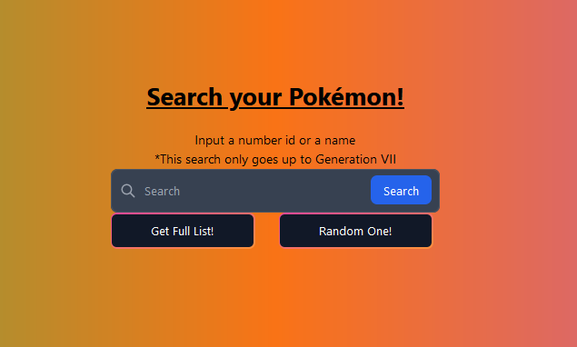

# React-mini-projects
Some tutorials and mini-projects that I've followed/developed

### Pokedex
I've been watching some tutorials and I've managed to do something on my own, its still raw, but its getting to something.
- [x] Complete list of Pokemon on load
- [x] Search for Pokemon using name
- [x] Style the frontend
- [x] Separate the list and the find

### MERN Workout App
I've followed the [The Net Ninja](https://www.youtube.com/c/TheNetNinja/videos) amazing MERN tutorial and now I'm adding extra stuff on my own, to practice.

- [x] Backend completed
- [x] Frontend completed
- [ ] Authentication
- [ ] Info for each user (after authentication)
- [ ] Extra fields and icons of level of dificulty
